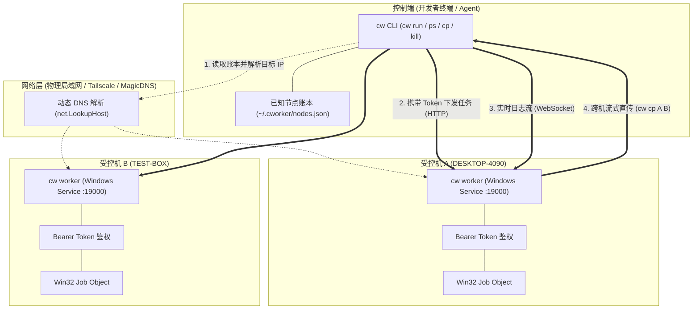

<div align="center">

# 🥕 cworker

**轻量级 Windows 任务编排与原生进程治理工具**

[](#-快速开始)
[](https://golang.org)
[](#-构建与开发)
[](LICENSE)

<p align="center">
  <a href="#-核心特性">核心特性</a> •
  <a href="#-架构拓扑">架构拓扑</a> •
  <a href="#-快速开始">快速开始</a> •
  <a href="#-命令行速查">CLI 速查</a> •
  <a href="#-节点账本与-tailscale-组网">网络与账本</a> •
  <a href="#-目录结构">目录结构</a> •
  <a href="#-构建与开发">构建指南</a> •
  <a href="#-ai-agent-集成">Agent 集成</a>
</p>

</div>

---

## 💡 设计背景

在日常开发、多机协作和 AI Agent 自动化调度中，常需要在多台 Windows 机器之间异步执行命令、跟踪日志与分发文件：
* **SSH / SCP**：在 Windows 上部署与配置 sshd 较为繁琐；会话中断或强制终止时极易残留孤儿后台子进程，且缺乏原生的任务状态查询与系统资源追踪；
* **tmux / pm2**：单机进程管理便捷，但缺乏原生跨机器统一调度与文件传输能力；
* **Docker / 容器化**：在 Windows 宿主下依赖 WSL2 / Hyper-V 虚拟机，内存开销大（GB 级），跨盘 I/O 损耗高，且难以直接直通宿主原生 GPU 驱动、物理盘符与硬件外设；
* **Slurm / K8s / Nomad**：体系过于庞大，配置繁琐，难以满足轻量级机器间毫秒级即发即收的调试诉求。

**cworker（主命令：`cw`）** 无需中心调度服务器与虚拟机运行时，收敛为一个约 7.8 MB 的 Windows 原生独立二进制文件（`cw.exe`），通过本地节点账本与直连通信，提供零沙盒损耗的多机任务与文件治理。

---

## ✨ 核心特性

- 🌐 **无中心架构与动态解析**：无需集中控制面或 UDP 广播。客户端通过本地账本（`~/.cworker/nodes.json`）与系统 DNS/mDNS 直连 Worker，原生支持跨网段与 Tailscale 异地组网。
- 🔒 **Ed25519 Token 鉴权与账本记忆**：Worker 首次启动自动派生持久化 Token；客户端连接配对一次后自动持久化到账本，后续请求自动注入 Token。
- 🛡️ **Win32 Job Object 内核级进程治理**：任务进程及其所有子孙进程归入 Windows 作业对象管辖。执行 `cw kill` 时由内核彻底销毁整棵进程树，杜绝孤儿进程残留。
- 🔒 **跨 Session 进程单例锁**：基于 Win32 命名互斥体 `Global\cworker_instance_port_<port>` 与全权限 SDDL，隔离 Session 0（系统服务）与 Session 1（交互终端），防止多开抢占端口。
- 🔓 **宿主原生权限**：Worker 继承当前运行用户权限，全盘物理路径透明访问，直通 GPU、CUDA 驱动及硬件外设。
- 🚀 **文件六件套治理（跨机与本地全打通）**：
  - `cp`：支持文件与目录的 本地 $\leftrightarrow$ 远端、远端 $\leftrightarrow$ 远端、本地 $\leftrightarrow$ 本地直传（`-r` 递归、`-j` 并发传输、空目录守恒、自动递归创建父级目录）；全链路单遍流式 SHA-256 强一致性核验与脏数据自动回滚；自适应平滑进度条（TTY 环境实时刷新，Non-TTY/Agent 环境单行摘要纯净输出）。
  - `diff`：跨机或本地文件与目录 SHA-256 强校验比对；单文件输出 Size 与 SHA-256 对比；`-r` 递归比对目录树，**默认排除全部相同文件**，仅打印变动条目并给出匹配汇总行；确定性退出码（`0` 一致，`1` 差异，`2` 异常）。
  - `cat`：直接在终端打印远端或本地文件文本内容，免去临时下载与清理。
  - `ls` / `md` / `rm`：目录清单、远端/本地递归创建目录以及非空删除安全拦截（脚本传 `-y` 可跳过确认）。
- 🩺 **实时资源采集**：整机 CPU、可用物理内存及单任务进程树开销实时采集。
- 📦 **系统服务自动化托管**：
  - `cw service install` 将当前二进制复制部署至独立副本 `%USERPROFILE%\.cworker\bin\cw.exe`；
  - 自动放行 Windows Defender 防火墙入站规则；
  - 自动注册至当前用户 `PATH` 环境变量；
  - 联动 Windows 服务控制管理器（SCM），崩溃后 1000ms 自动重启自愈；卸载时逆向复原。

---

## 🏗️ 架构拓扑



---

## ⚡ 快速开始

### 1. 受控机配置（只需执行一次，以管理员身份运行 PowerShell）

```powershell
# 1. 注册为 Windows 系统服务并启动 (开机自启、无黑窗口、崩溃自愈)
cw service install
cw service start

# 2. 查看本机名片与配对命令
cw show
```

### 2. 控制端日常调度

首次配对目标节点（支持计算机名或 IP）：

```powershell
# 添加节点至本地账本 (未显式指定端口时默认推导为 19000)
cw node add desktop-4090 --token "目标机_Token"

# 亦可直接跨网段或通过 Tailscale IP 配对:
# cw node add desktop-4090 100.93.237.16:19000 --token "目标机_Token"
```

配对完成后直接派发与治理任务：

```powershell
# 1. 探测已知节点健康状态与实时负载
cw nodes

# 2. 派发后台任务 (支持指定工作目录 --dir 与任务名 --name)
cw run -n desktop-4090 --dir "D:\projects\ml" "python train.py --epochs 100"

# 3. 查看全集群任务状态与 CPU / 内存开销
cw ps

# 4. 实时跟随任务输出日志 (WebSocket)
cw logs job-58a90e40 -f

# 5. 终止任务 (内核级连根清理整棵进程树)
cw kill job-58a90e40
```

---

## 📖 命令行速查

### 1. 节点与账本管理
| 命令 | 说明 |
| :--- | :--- |
| `cw show [--refresh]` | 输出本机名片（计算机名、IP 列表、服务状态及配对命令）；`--refresh` 可轮换 Token |
| `cw nodes` | 并发探测所有已知节点在线状态及整机负载 |
| `cw node add <name> [target] [--token xxx]` | 登记新节点至本地账本（省略 `target` 时自动推导为 `<name>:19000`） |
| `cw node rm <name>` | 从已知节点账本中注销节点 |
| `cw worker [--port port]` | 前台启动节点服务（适用于临时调试排查） |
| `cw service install [--port port]` | 部署至 `~/.cworker/bin`、放行防火墙并注册系统服务（需管理员权限） |
| `cw service uninstall` | 卸载系统服务并复原防火墙与环境变量（需管理员权限） |
| `cw service start / stop / status` | Windows 系统服务生命周期启停与状态查询（需管理员权限） |

### 2. 任务调度与进程控制
| 命令 | 说明 |
| :--- | :--- |
| `cw run [-n node] [--dir dir] [--name name] [--token xxx] <cmd>` | 异步派发新任务并立即返回 `job-<hex>` 句柄；若携带 `--token` 则在鉴权成功后自动记忆更新至本地账本 |
| `cw ps` | 并发拉取全网所有已知节点的任务运行状态、资源占用与命令 |
| `cw logs <job_id> [-f] [-n lines]` | 查看任务日志；带 `-f` 实时跟随，`-n` 截取末尾行数（默认 100） |
| `cw kill <job_id>` | 终止任务并销毁整棵子进程树（基于 Win32 Job Object） |
| `cw version` / `cw -v` | 查看当前软件版本号、构建日期与 Go 运行环境 |

### 3. 跨机与本地文件治理
| 命令 | 行为与特性 |
| :--- | :--- |
| `cw cp [-r] [-j <n>] [<node>:]<src> [<node>:]<dest>` | 支持文件与目录 本地 $\leftrightarrow$ 远端、远端 $\leftrightarrow$ 远端、本地 $\leftrightarrow$ 本地；单遍流式 SHA-256 校验；`-r` 递归拷贝，`-j` 并发连接数（默认 8） |
| `cw diff [-r] [--limit <n>] [--all] [<node>:]<src> [<node>:]<dest>` | 跨机或本地文件/目录 SHA-256 强校验比对；`-r` 递归比对，默认排除相同文件，大差异自动截断（默认 50 条）；退出码：`0` 一致，`1` 差异，`2` 异常 |
| `cw cat [<node>:]<path>` | 直接在控制台终端打印远端或本地文件文本内容 |
| `cw ls [<node>:]<path>` | 结构化输出远端或本地目录结构、大小与修改时间 |
| `cw md [<node>:]<path>` | 远端或本地递归创建目录（等同 `mkdir -p`） |
| `cw rm [-r] [-y] [<node>:]<path>` | 删除远端或本地文件或目录；非空目录需 `-r`，脚本调用带 `-y` 可跳过二次确认 |

---

## 🌐 节点账本与 Tailscale 组网

### 1. 账本存储 (`%USERPROFILE%\.cworker\nodes.json`)
```json
{
  "desktop-4090": {
    "name": "desktop-4090",
    "target": "desktop-4090:19000",
    "token": "d7a8f9c1e2b34a5d..."
  },
  "gpu-box": {
    "name": "gpu-box",
    "target": "gpu-box.tailnet-xyz.ts.net:19000",
    "token": "b2c3d4e5f6a1..."
  }
}
```

### 2. Tailscale 异地组网实战
cworker 基于标准系统 DNS 解析（`net.LookupHost`），无需公网 IP 或路由器端口转发即可通过 Tailscale 跨地域直连：
1. **在受控机获取名片**：运行 `cw show`，复制输出的 Tailscale 虚拟 IP 与 Token；
2. **在控制端配对**：
   ```powershell
   # 支持 Tailscale 100.x 虚拟 IP 或 MagicDNS 域名
   cw node add gpu-box 100.86.120.45:19000 --token "xxx"
   # 或
   cw node add gpu-box gpu-box.tailnet-xyz.ts.net:19000 --token "xxx"
   ```
3. **日常调用**：此后直接执行 `cw run -n gpu-box "<cmd>"`，系统自动按域名或 IP 建立隧道直连。

---

## 📁 目录结构

### 1. 代码工程目录
```text
cworker/
├── .github/workflows/    # CI/CD (自动化测试与 Release 打包)
├── cmd/                  # Cobra CLI 命令定义 (run, ps, logs, cp, service...)
├── pkg/
│   ├── client/           # HTTP/WS 客户端与 Known-Nodes 账本管理
│   ├── worker/           # Worker 后台服务引擎与 API 路由
│   ├── process/          # Win32 Job Object 孤儿治理与跨 Session 单例互斥锁
│   ├── logstream/        # WebSocket 广播式日志流分发
│   ├── pathutil/         # Windows 物理路径与 node:path 强类型智能归一化
│   └── protocol/         # 核心通信协议契约 (SSOT)
├── skills/cworker/       # AI Agent 本地技能定义
├── test/                 # 集群全拓扑、高并发与故障注入原生集成测试套件
└── build.bat             # 一键单二进制编译与端到端集成测试脚本
```

### 2. 默认运行时存储目录 (`%USERPROFILE%\.cworker`)
```text
%USERPROFILE%\.cworker/
├── bin\
│   └── cw.exe            # 独立生产服务副本 (避免开发调试锁死占用)
├── nodes.json            # 已知节点账本 (名称、直连地址与 Token)
├── token                 # 本机 Worker 安全 Token
├── daemon.log            # Windows 后台系统服务守护日志
└── jobs\
    └── job-<hex>\
        └── output.log    # 各任务的持久化运行日志 (按需拉取)
```

---

## 🛠️ 构建与开发

使用仓库内置构建脚本即可完成日常开发流：
```cmd
:: 1. 编译单二进制至 bin\cw.exe
build.bat

:: 2. 编译并运行全量单元测试
build.bat test

:: 3. 运行双节点无广播与进程治理端到端全链路实测
build.bat all
```

---

## 🤖 AI Agent 集成

仓库本地内置了供 AI Agent（如 Claude Code、OpenCode、Cursor、Codex、Antigravity 等）直接使用的技能定义与调用约束：

* 📘 **技能定义**：[`skills/cworker/SKILL.md`](skills/cworker/SKILL.md)（与 [`.agents/skills/cworker/SKILL.md`](.agents/skills/cworker/SKILL.md) 保持一致）
* 📜 **调用约束与避坑准则**：[AGENTS.md](AGENTS.md)（含任务异步轮询规范、`cw rm -r -y` 高危防交互死锁说明）

---

## 📄 开源许可证

本项目基于 [Apache License 2.0](LICENSE) 开源。
